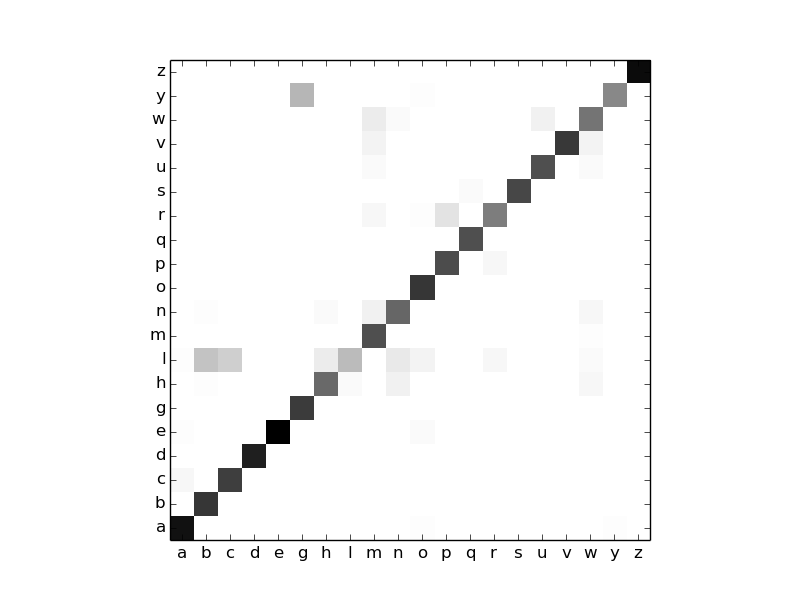

# Continuous Hidden Markov Model for Temporal Classification

## Introduction
Use CHMM to classify temporal sequence.

## Dependencies
1. numpy
2. sklearn

## Usage
Run `main.py`, you can:
1. Train a CHMM for each one character of 20 in total, with `50%` data.
2. Test on the rest `50%` data with trained models.
3. Plot a confusion matrix on the testing set.

```python
    python main.py
```

## Data
### CharacterTrajectory Dataset
It's a dataset of differential 2D-trajectories, which are temporal sequences, with `dimension=2` and `length=182` (zeros padded).
1. First Download `.zip` from [here](http://timeseriesclassification.com/description.php?Dataset=CharacterTrajectories).
2. Run [dataprocess](https://github.com/SongDark/timeseries_infogan/blob/master/dataprocess.py) to generate `.npz` file.

## Confusion Matrix
The x-axis is `label`, y-axis is `prediction`.

<centering>



## Tricks for Training
1. **Moving Average Filtering** to smooth the sequence.
2. **Z-score normalization** to convert sequences to `0` means and `1` variance.
3. Remove all the zero paddings if any.
4. Assign `state count` and `gaussian count` according to character strokes, it'd better to plot some sequences for observation.
5. Handle **matrix division** carefully, replace `zeros` with very small positives.
6. Use **Log trick** to avoid **Overflow**, especially in computation of `b`. 
7. **Normalize at each timestep** to avoid **Vanishing**, especially in computation of `alpha` and `beta`.
8. If you meet **Singular** covariances, try to adjust `state count` and `gaussian count`, or diagonalize the matrix.

